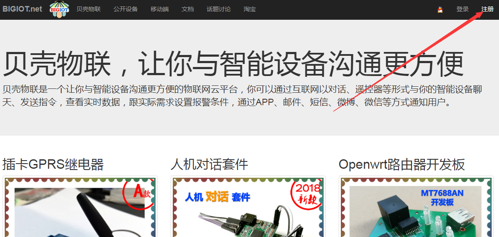
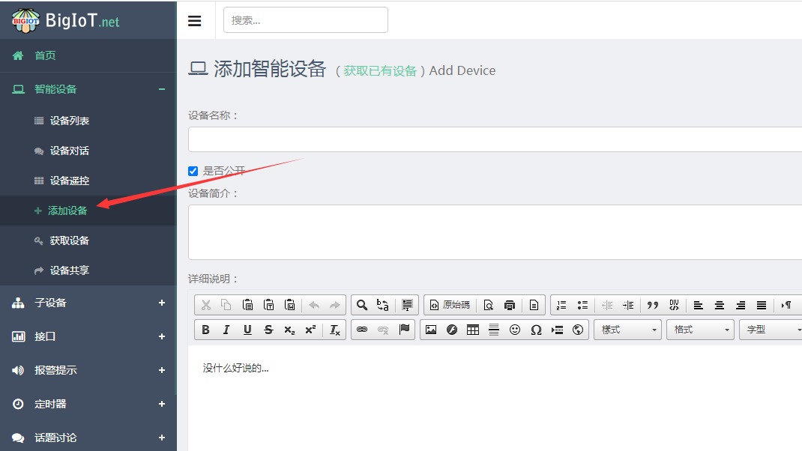
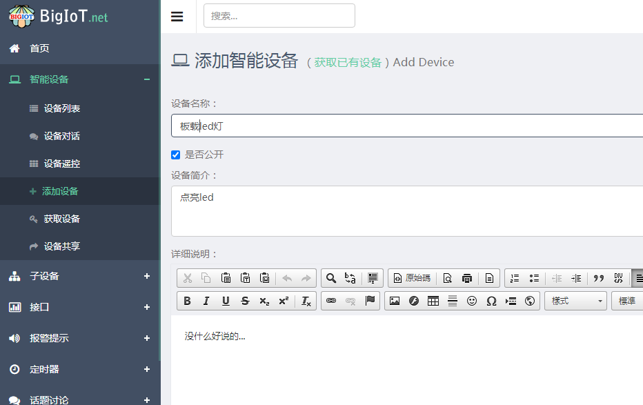
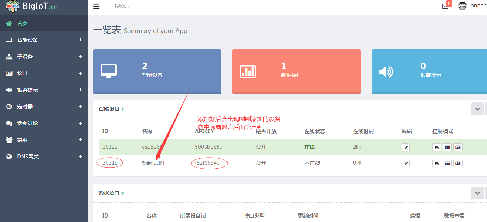
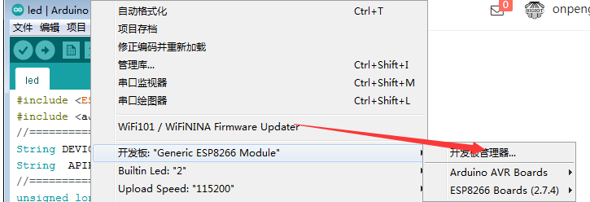
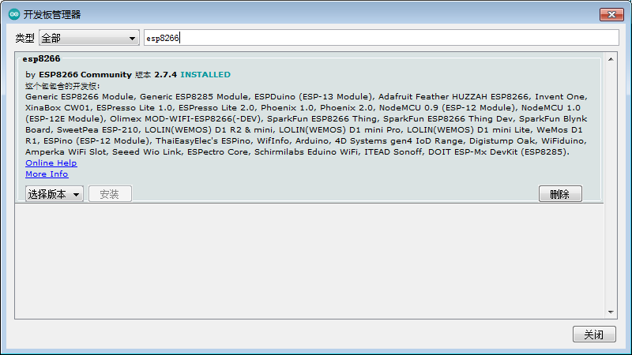
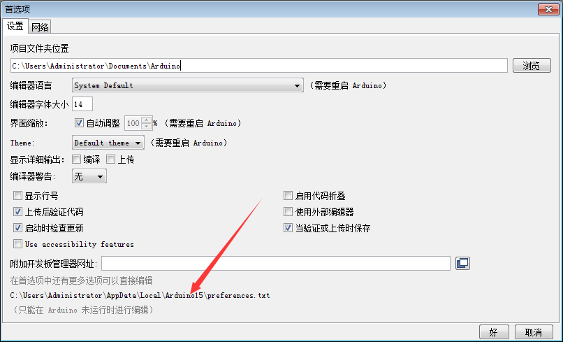
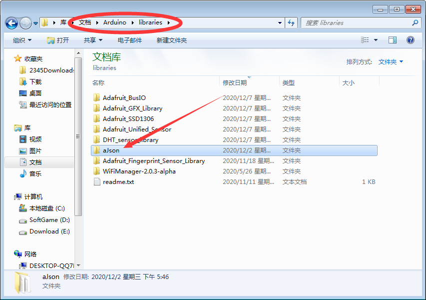
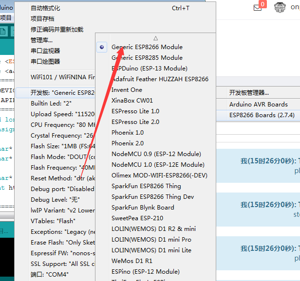
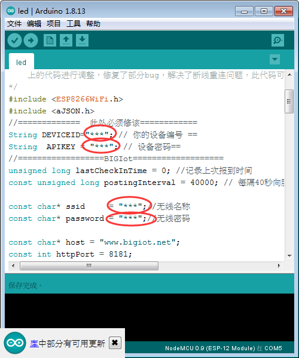

# BigIot-esp8266-led #
## 注册贝壳物联 ##
- 进入贝壳物联官网[Here](https://www.BigIot.net)
- 
- 注册好后登陆
- 点击添加设备
- 
- 里面参数随便填写
- 
- 

## ESP8266的库下载 ##
### 方式一：添加地址在arduino里进行下载 ###
- https://arduino.esp8266.com/stable/package_esp8266com_index.json
- 将此链接添加到首选项->附加开发板管理器网址
- 
- 
- 进入开发板管理器进行下载安装
- 
### 方法二：手动添加 ###
- 点击此处打开Arduino15文件夹
- 
- 将下载的库解压到此处
- 重新打开Arduino软件。

## 打开点灯程序进行烧录 ##
- 首先将a.json库放入 文档->Arduino->libraries
- 
- 打开led.ino文件
- 选择开发板
- 
- 将之前看到的**设备ID、API以及自己环境的wifi账号密码**填上
- 
- 最后上传代码即可
